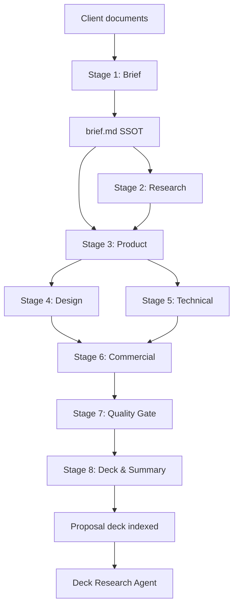

# Pre-Sales Skills — Workflow Guide

A generic guide for teams who **fork or clone** this repository and deploy skills as **Snowflake Cortex Agents** — with optional **Cortex Search** for persistent document and deck retrieval.

---

## What this repository provides

| Component | Location | Purpose |
|-----------|----------|---------|
| **Skills** | [`skills/pre-sales/`](../skills/pre-sales/) | 26 workflow skills (`SKILL.md` per folder) |
| **Workspace template** | [`Pre-sales-template/`](../Pre-sales-template/) | Input/Output folders + orchestration in [`AGENTS.md`](../Pre-sales-template/AGENTS.md) |
| **Cortex Search template** | [`templates/cortex-search/`](../templates/cortex-search/) | Tables, search services, deck Q&A agent |
| **Deployment skills** | [`skills/global/`](../skills/global/) | Config generator, agent converter, bulk deploy |

---

## Two ways to work with documents

### A. Chat uploads (no setup)

Cortex Agents in Snowflake Intelligence can read **uploaded PDFs and DOCX** directly in the conversation. Point the agent at a skill from Git and attach the client RFP — sufficient for Stages 1–8 without any Snowflake objects.

### B. Cortex Search (recommended for teams)

Index documents in Snowflake tables so agents **search across sessions** and multiple users share the same project memory:

| Search service | Documents |
|----------------|-----------|
| `SOURCE_DOCUMENTS_SEARCH` | RFP, brief, SOW, client notes |
| `WORKFLOW_OUTPUTS_SEARCH` | Personas, PRDs, estimates, all `Output/` artifacts |
| `PROPOSAL_DECK_SEARCH` | Deck outline, executive summary, pitch slides |

Setup: [`templates/cortex-search/README.md`](../templates/cortex-search/README.md)

---

## Workspace setup (after fork)

```
your-repo/
├── skills/pre-sales/           ← attach to Cortex Agents via Git
├── Pre-sales-template/
│   ├── Input/Brief/            ← client RFP, notes (local or ingest to Search)
│   └── Output/                 ← skill outputs (01_Research … 06_Final)
└── templates/cortex-search/  ← run SQL to enable document search
```

1. Clone/fork the repo and connect it as a **Snowflake Git integration**.
2. Copy `Pre-sales-template/` or merge Input/Output into your project layout.
3. Place the client RFP in `Input/Brief/`.
4. (Optional) Run Cortex Search setup and ingest documents — see template README.
5. Attach skills to agents using Git paths, e.g. `@repo/.../skills/pre-sales/rfp-analyzer`.

---

## Workflow overview



**Review gates** (pause for human approval): after Stages 1, 3, 6, and 7 — see [`AGENTS.md`](../Pre-sales-template/AGENTS.md).

---

## Stage-by-stage reference

Each stage lists: **skill** → **what it does** → **output path** → **Cortex Search tool** (if configured).

### Stage 1 — Initialization

| Skill | [`rfp-analyzer`](../skills/pre-sales/rfp-analyzer/SKILL.md) |
|-------|-----|
| **Input** | RFP, SOW, client notes (`Input/Brief/` or uploaded PDF) |
| **Action** | Company research, platform map, golden-thread narrative, requirement tables, follow-up questions |
| **Output** | `Input/Brief/brief.md` — **Single Source of Truth** for all later stages |
| **Search** | `search_source_documents` — retrieve RFP sections when PDF is indexed |

🛑 **STOP & REVIEW** — Validate brief before continuing.

---

### Stage 2 — Research & Discovery

Run after `brief.md` exists. **Order:** personas → market/competitor/stakeholder → customer journey → problem statements last.

| Skill | Output |
|-------|--------|
| [`user-personas`](../skills/pre-sales/user-personas/SKILL.md) | `Output/01_Research/personas.md` |
| [`market-research-analysis`](../skills/pre-sales/market-research-analysis/SKILL.md) | `Output/01_Research/market-research.md` |
| [`competitor-analysis`](../skills/pre-sales/competitor-analysis/SKILL.md) | `Output/01_Research/competitor-analysis.md` |
| [`stakeholder-mapping`](../skills/pre-sales/stakeholder-mapping/SKILL.md) | `Output/01_Research/stakeholder-map.md` |
| [`customer-journey`](../skills/pre-sales/customer-journey/SKILL.md) | `Output/01_Research/customer-journey.md` |
| [`problem-statements`](../skills/pre-sales/problem-statements/SKILL.md) | `Output/01_Research/problem-statements.md` |

**Search:** `search_source_documents` + `search_workflow_outputs` for cross-referencing brief and prior research.

---

### Stage 3 — Product Definition

| Skill | Output |
|-------|--------|
| [`feature-extraction`](../skills/pre-sales/feature-extraction/SKILL.md) | `Output/02_Product/feature-list.md` |
| [`prd-generator`](../skills/pre-sales/prd-generator/SKILL.md) | `Output/02_Product/prd-*.md` |
| [`phased-roadmap`](../skills/pre-sales/phased-roadmap/SKILL.md) | `Output/02_Product/roadmap.md` |
| [`information-architecture`](../skills/pre-sales/information-architecture/SKILL.md) | `Output/02_Product/information-architecture.md` |
| [`user-flows`](../skills/pre-sales/user-flows/SKILL.md) | `Output/02_Product/user-flows.md` |
| [`success-metrics`](../skills/pre-sales/success-metrics/SKILL.md) | `Output/02_Product/success-metrics.md` |

**Search:** `search_workflow_outputs` — PRD skills often need research + brief context from index.

🛑 **STOP & REVIEW** — Lock scope (feature list + roadmap).

---

### Stage 4 — Design Direction

| Skill | Output |
|-------|--------|
| [`design-assumptions`](../skills/pre-sales/design-assumptions/SKILL.md) | `Output/04_Technical/design-assumptions.md` |
| [`brand-guidelines`](../skills/pre-sales/brand-guidelines/SKILL.md) | `Output/03_Design/brand-guidelines.md` |
| [`prototype-screens`](../skills/pre-sales/prototype-screens/SKILL.md) | `Output/03_Design/prototype-*.md` |

---

### Stage 5 — Technical Strategy

| Skill | Output |
|-------|--------|
| [`technical-assumptions`](../skills/pre-sales/technical-assumptions/SKILL.md) | `Output/04_Technical/technical-assumptions.md` |
| [`tech-stack-analysis`](../skills/pre-sales/tech-stack-analysis/SKILL.md) | `Output/04_Technical/tech-stack.md` |

**Search:** Useful when RFP defines integrations, compliance, or architecture constraints in indexed source docs.

---

### Stage 6 — Estimation & Commercial

| Skill | Output |
|-------|--------|
| [`design-estimation`](../skills/pre-sales/design-estimation/SKILL.md) | `Output/05_Commercial/design-estimation.md` |
| [`dev-estimation`](../skills/pre-sales/dev-estimation/SKILL.md) | `Output/05_Commercial/dev-estimation.md` |
| [`effort-summary`](../skills/pre-sales/effort-summary/SKILL.md) | `Output/05_Commercial/effort-summary.md` |
| [`conditions-assumptions`](../skills/pre-sales/conditions-assumptions/SKILL.md) | `Output/05_Commercial/conditions-assumptions.md` |
| [`pricing-packaging`](../skills/pre-sales/pricing-packaging/SKILL.md) | `Output/05_Commercial/pricing-options.md` |

**Tip:** Ingest `feature-list.md` and `information-architecture.md` into `WORKFLOW_OUTPUTS` before estimation skills run — search helps sizing stay aligned with scope.

🛑 **STOP & REVIEW** — Confirm commercials and timeline.

---

### Stage 7 — Quality Gate

| Skill | [`proposal-quality-gate`](../skills/pre-sales/proposal-quality-gate/SKILL.md) |
|-------|-----|
| **Action** | Audit all outputs against `brief.md`; flag scope gaps, estimation mismatches, missing requirements |
| **Output** | `Output/06_Final/quality-gate-report.md` |
| **Search** | `search_source_documents` + `search_workflow_outputs` — automated cross-check against indexed RFP and deliverables |

🛑 **STOP & REVIEW** — Fix mandatory items before packaging.

---

### Stage 8 — Final Packaging

| Skill | Output |
|-------|--------|
| [`executive-summary`](../skills/pre-sales/executive-summary/SKILL.md) | `Output/06_Final/executive-summary.md` |
| [`proposal-deck-outline`](../skills/pre-sales/proposal-deck-outline/SKILL.md) | `Output/06_Final/deck-outline.md` |

**After Stage 8:** ingest deck + summary via `INDEX_FINAL_ASSETS` (see [nexus ingest](../../nexus-agent-templates/ingest/08_index_final_assets.sql)).

---

## Searching the proposal deck

Once deck content is indexed, use the **Deck Research Agent** ([spec](../templates/cortex-search/agents/deck-research-agent.spec.json)):

```sql
CREATE OR REPLACE AGENT MY_PROJECT.PRE_SALES.DECK_RESEARCH_AGENT
FROM SPECIFICATION $spec$ ... $spec$;
```

| User question | Agent behavior |
|---------------|----------------|
| *"What's on slide 5?"* | `search_proposal_deck` → returns key message + visual spec |
| *"Does our timeline match the RFP deadline?"* | `search_proposal_deck` + `search_source_documents` |
| *"What dev estimate supports the MVP slide?"* | `search_proposal_deck` + `search_workflow_outputs` |

This separates **deck authoring** (Stage 8 skills) from **deck Q&A** (search-enabled agent for stakeholders prepping for the pitch).

---

## Attach skills to a Cortex Agent (Git)

```sql
ALTER AGENT MY_DB.MY_SCHEMA.PRESALES_ORCHESTRATOR
  MODIFY LIVE VERSION SET SPECIFICATION = $$
  {
    "models": {"orchestration": "auto"},
    "skills": [
      {
        "name": "rfp-analyzer",
        "source": {
          "type": "GIT",
          "path": "@MY_DB.MY_SCHEMA.skills_repo/tags/latest/skills/pre-sales/rfp-analyzer"
        }
      }
    ],
    "tools": [
      {
        "tool_spec": {
          "type": "cortex_search",
          "name": "search_source_documents",
          "description": "Search client RFPs, briefs, and source documents."
        }
      }
    ],
    "tool_resources": {
      "search_source_documents": {
        "search_service": "MY_PROJECT.PRE_SALES.SOURCE_DOCUMENTS_SEARCH",
        "id_column": "DOC_ID",
        "title_column": "TITLE",
        "max_results": 8
      }
    }
  }
  $$;
```

List discoverable skills:

```sql
LS @MY_DB.MY_SCHEMA.skills_repo/tags/latest/skills/pre-sales/ PATTERN='.*SKILL\.md';
```

---

## Suggested ingestion cadence

| When | Ingest into |
|------|-------------|
| RFP received | `SOURCE_DOCUMENTS` |
| Stage 1 complete | `SOURCE_DOCUMENTS` (brief) |
| Each stage complete | `WORKFLOW_OUTPUTS` (batch or per file) |
| Stage 8 complete | `PROPOSAL_DECK` (per slide/section) |
| Before pitch meeting | Verify deck index; use Deck Research Agent |

---

## Quick-start prompts

Run inside your workspace (local IDE or Snowflake Intelligence with skills attached):

```
1. "Analyze the RFP in Input/Brief and generate brief.md"
2. "Generate user personas, market research, competitor analysis, stakeholder map"
3. "Map customer journeys and define problem statements"
4. "Extract features, generate PRDs, roadmap, IA, and user flows"
5. "Generate design assumptions, brand guidelines, prototype screens"
6. "Document technical assumptions and recommend the tech stack"
7. "Generate design and dev estimates, effort summary, conditions, pricing options"
8. "Run the proposal quality gate"
9. "Generate executive summary and proposal deck outline"
10. "Search the deck: what does the timeline slide say about MVP delivery?"
```

---

## Mapping skills to typical RFP proposal sections

Most client RFPs ask for sections like these — your indexed outputs feed each one:

| Typical RFP ask | Primary outputs | Search service |
|-----------------|-----------------|----------------|
| Understanding of the project | `brief.md`, `problem-statements.md`, `feature-list.md` | Source + Outputs |
| Collaboration model | `stakeholder-map.md`, `conditions-assumptions.md` | Outputs |
| Technical approach | `tech-stack.md`, `technical-assumptions.md`, PRDs | Outputs + Source |
| Timeline | `effort-summary.md`, `roadmap.md` | Outputs |
| Budget / packaging | `pricing-options.md`, estimates | Outputs |
| Risks & assumptions | `quality-gate-report.md`, `technical-assumptions.md` | Outputs + Source |
| Presentation / deck | `deck-outline.md`, `executive-summary.md` | **Proposal Deck** |

---

## Example scenario (anonymized)

A **B2B platform RFP** for a multi-system product (partner portal + admin console, third-party integrations, phased MVP → Phase 2/3) maps cleanly to this workflow:

- **Stage 1** extracts ecosystem boundaries (which systems are in vs out of MVP scope)
- **Stage 3** separates contractual MVP from future phases in `roadmap.md`
- **Stage 5** documents integration assumptions (DAM, CRM, external tools)
- **Stage 6** splits binding MVP budget from indicative future phase ranges
- **Stage 7** verifies no Phase 2 scope leaked into MVP estimates
- **Stage 8** produces deck aligned to the RFP's required proposal outline
- **Deck agent** answers stakeholder questions from indexed slide content

Keep client PDFs **out of git** (see root `.gitignore`); ingest text into Cortex Search instead.

---

## Author

Skills in this repository were created by **Seven Peaks Software**.

## Related docs

- [templates/cortex-search/README.md](../templates/cortex-search/README.md) — Search setup & deck agent
- [skills/README.md](../skills/README.md) — Skill paths and Git conventions
- [Pre-sales-template/AGENTS.md](../Pre-sales-template/AGENTS.md) — Full orchestration rules
- [Snowflake Cortex Agent Skills](https://docs.snowflake.com/en/user-guide/snowflake-cortex/cortex-agents-skills)
