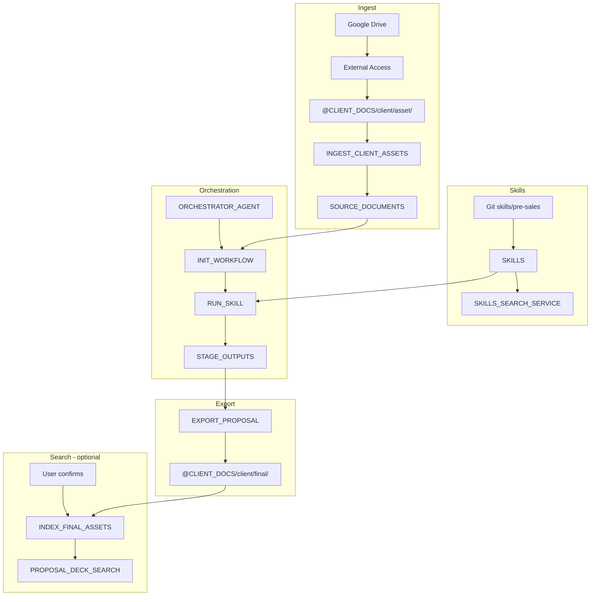

# Nexus Agent Templates

Snowflake deployment templates for the **E2E pre-sales document prep pipeline**: Google Drive ingest → Nexus orchestration harness → PDF export → optional Cortex Search.

## Structure

```
nexus-agent-templates/
├── deploy_config.example.sql   # Account/schema/warehouse variables
├── ingest/                     # Drive sync, ingest, skills Git sync, export, search
└── orchestration/              # ORCHESTRATOR_AGENT + RUN_SKILL harness
```

## Architecture



## Quick deploy

1. Set variables in `deploy_config.sql` (from `deploy_config.example.sql`).
2. Follow [ingest/README.md](ingest/README.md) deploy order.
3. Follow [orchestration/README.md](orchestration/README.md) for agents and harness SPs.
4. Resume scheduled tasks after validation:
   ```sql
   ALTER TASK TASK_SYNC_CLIENT_ASSETS RESUME;
   ALTER TASK TASK_SYNC_SKILLS_FROM_GIT RESUME;
   ```

## User flow (Orchestrator)

1. *"Start proposal for easia-hub"* → `sync_client_assets` → `ingest_client_assets` → `init_workflow`
2. Harness loop: `plan_stage` → `run_skill` → `evaluate_output` → `advance_stage` (gates at 1, 3, 6, 7)
3. Stage 8 complete → `export_proposal` → PDF in `@CLIENT_DOCS/easia-hub/final/` (via SPCS Gotenberg)
4. Ask user → on confirm: `index_final_assets` → use `DECK_RESEARCH_AGENT` for deck Q&A

## PDF export (SPCS Gotenberg)

Deploy Gotenberg on Snowpark Container Services: [ingest/spcs-gotenberg/README.md](ingest/spcs-gotenberg/README.md)

## Related docs

- [E2E architecture](../docs/e2e-sales-workflow-architecture.md)
- [Pre-sales workflow guide](../docs/examples/pre-sales-workflow-guide.md)
- [Skills inventory](../skills/README.md)
